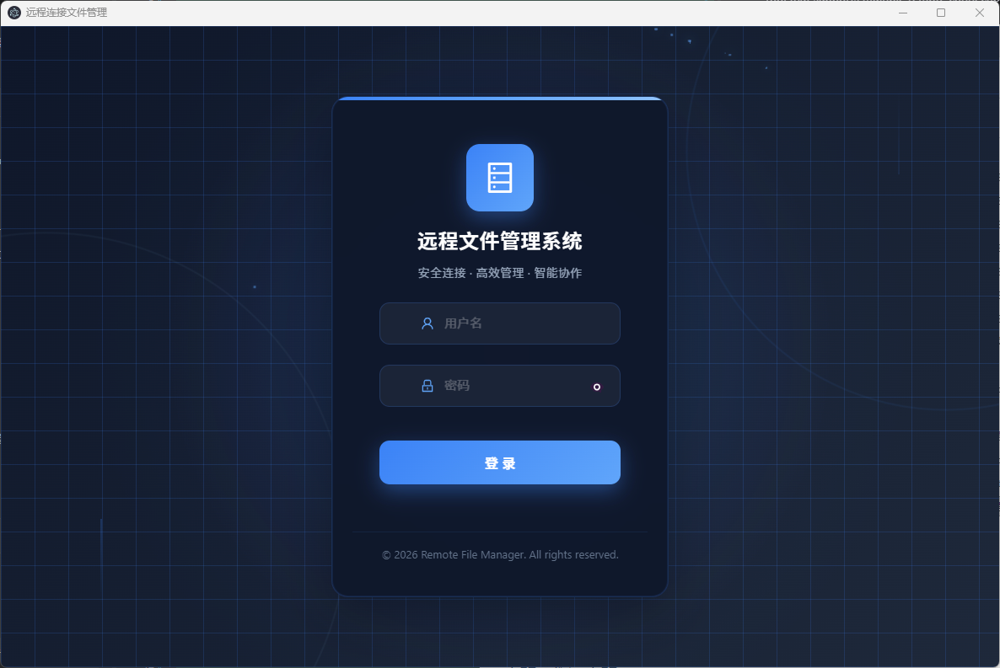
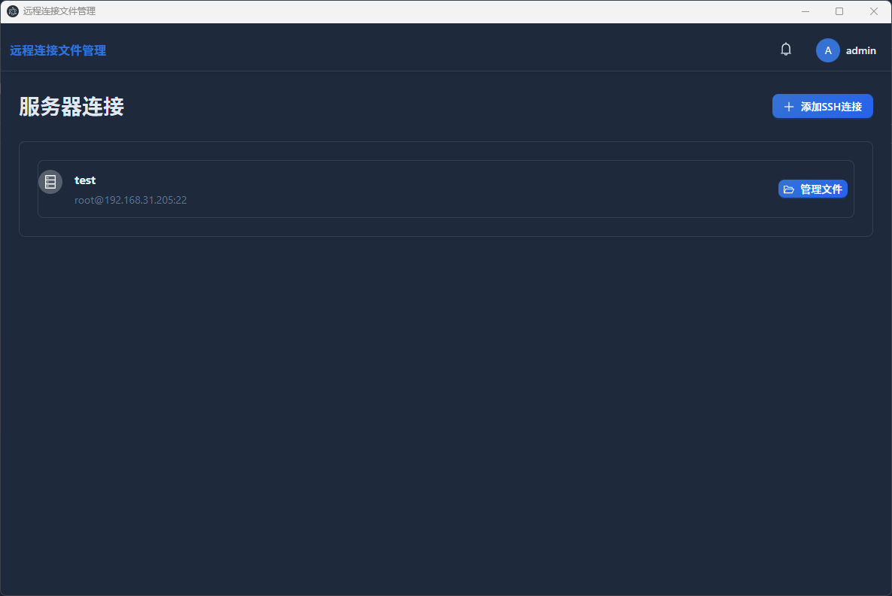
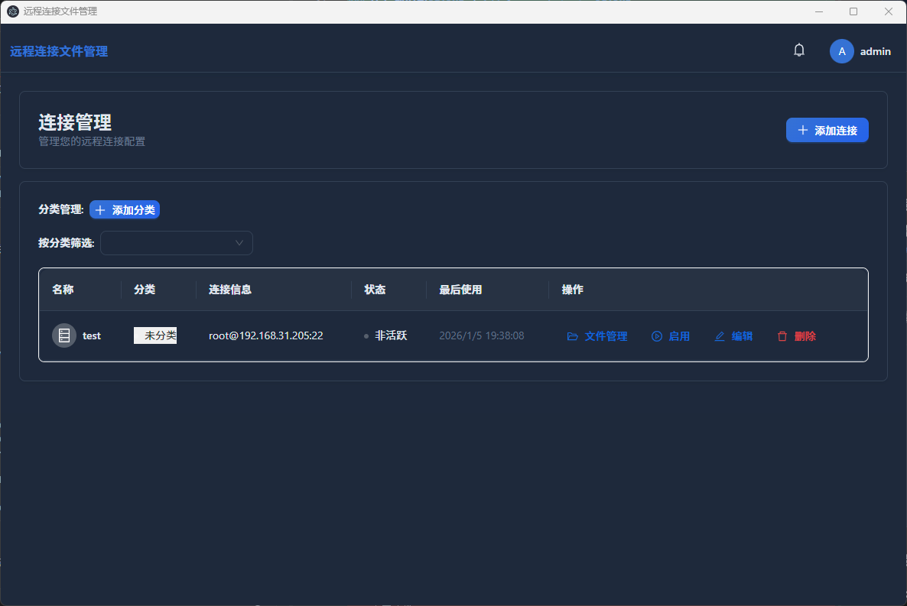
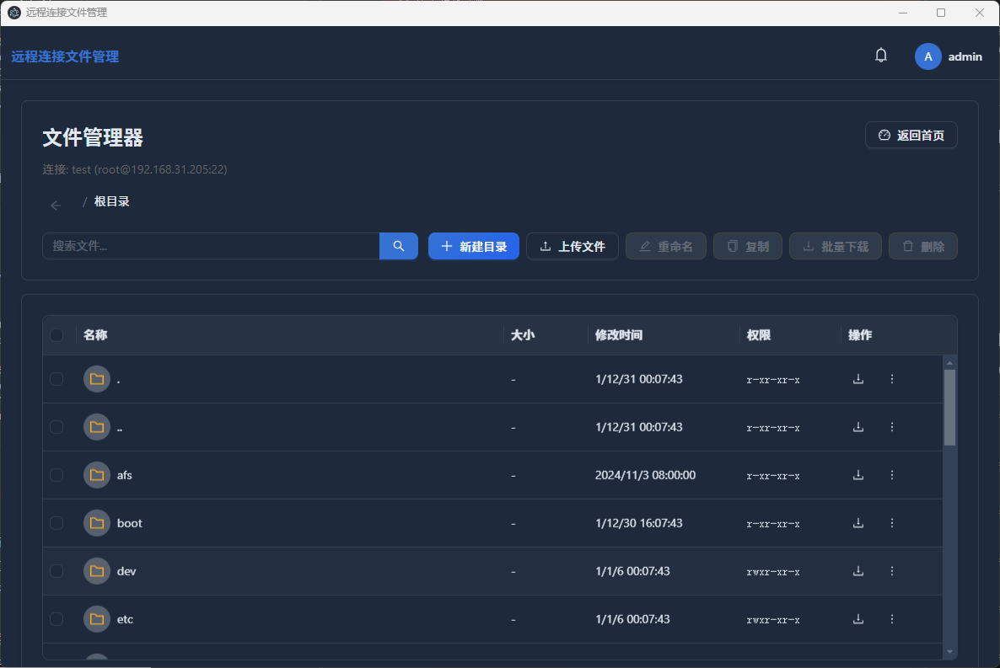
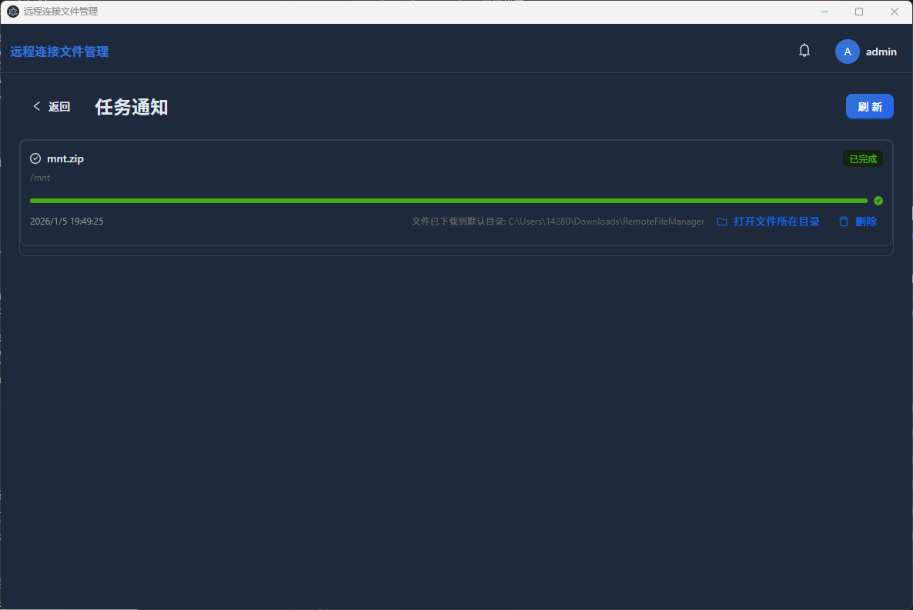
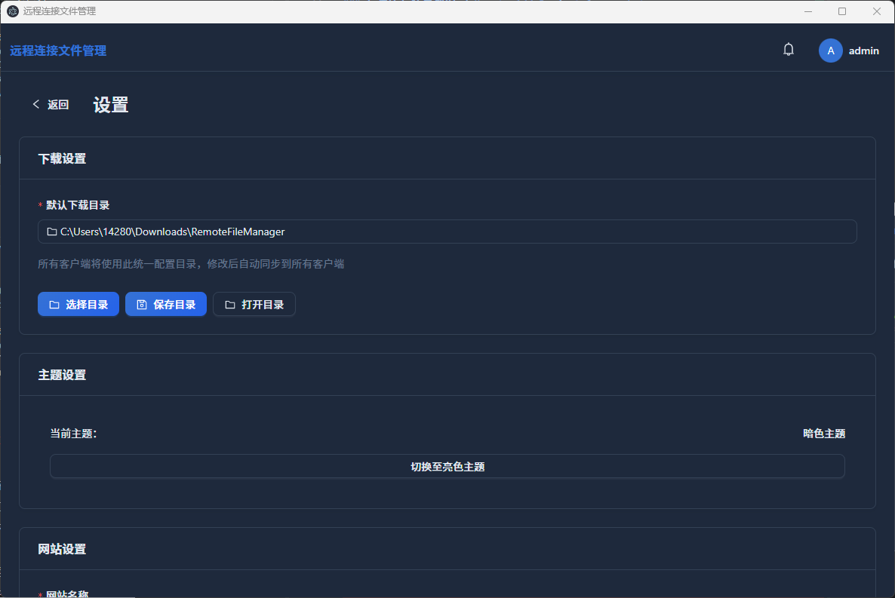

# 🌐 Remote Connection File Management System

## 📖 Project Introduction

Remote Connection File Management System is a powerful cross-platform file management tool that supports multiple remote connection protocols and provides an intuitive web interface for users to manage files on remote servers.

## 🖼️ Feature Showcase

### How to Add Project Screenshots
1. Create a `screenshots` folder in the project root directory
2. Place project screenshots in this folder according to the following naming rules:
   - `login.png` - Login interface
   - `dashboard.png` - Dashboard
   - `connection-management.png` - Connection management
   - `file-manager.png` - File management
   - `task-management.png` - Task management
   - `settings.png` - Settings interface

### Add Screenshots to README

### Login Interface


### Dashboard


### Connection Management
<!--  -->

### File Management
<!--  -->

### Task Management
<!--  -->

### Settings Interface
<!--  -->

## 🔌 Supported Server Types

### 1. SSH (Secure Shell) 🔒
- **Protocol Introduction**: SSH is an encrypted network transmission protocol used for secure remote login and other network services on insecure networks.
- **Main Features**:
  - 🔐 Secure remote command execution
  - 📁 File transfer (via SFTP or SCP)
  - 🔀 Port forwarding and tunneling
  - 🔑 Key authentication support
- **Usage Scenarios**: Suitable for scenarios requiring secure remote access to Linux/Unix servers
- **Connection Requirements**: Need to know the server's IP address, port (default 22), username and password or SSH key

### 2. SFTP (SSH File Transfer Protocol) 📤
- **Protocol Introduction**: SFTP is an SSH-based file transfer protocol that provides encrypted file transfer services.
- **Main Features**:
  - 🔐 Secure file upload and download
  - 📁 Create, delete, rename files and directories
  - 🔑 File permission management
  - ⏸️ Resume transfer support
- **Usage Scenarios**: Suitable for scenarios requiring secure file transfer between local and remote servers
- **Connection Requirements**: Need to know the server's IP address, port (default 22), username and password or SSH key

### 3. FTP (File Transfer Protocol) 📡
- **Protocol Introduction**: FTP is a traditional file transfer protocol used for file transfer over networks.
- **Main Features**:
  - 📤 File upload and download
  - 📁 File and directory management
  - 📦 Batch file operations
- **Usage Scenarios**: Suitable for scenarios requiring simple file transfer
- **Connection Requirements**: Need to know the server's IP address, port (default 21), username and password

## 📋 System Requirements

- **Operating System**: Windows 10/11 or Linux (Ubuntu 18.04+, CentOS 7+, etc.)
- **Browser**: Supports modern browsers (Chrome 90+, Firefox 88+, Edge 90+, etc.)
- **Network**: Requires network connection to access the web interface

## 🚀 Running Methods

### Windows System

1. 📦 Extract the compressed package
2. 🖱️ Double-click to run the `start.bat` file
3. 🎉 The system will automatically start the server and open the browser
4. 🌐 Access `http://localhost:8080` in the browser

### Linux System

1. 📦 Extract the compressed package
2. 💻 Open the terminal and enter the extracted directory
3. 🔧 Run `chmod +x start.sh` to grant execution permissions
4. 🚀 Run `./start.sh` to start the system
5. 🌐 Access `http://localhost:8080` in the browser

## ⚙️ Manual Running Method

### Start the Server

- **Windows**: 🖱️ Double-click `server-windows.exe`
- **Linux**: 💻 Run `./server-linux`

### Access the System

🌐 Enter `http://localhost:8080` in the browser

## 📁 Project Structure

```
dist/
├── client/          # Frontend static files 🎨
├── data/            # Database files 📊
├── logs/            # Log files 📝
├── permissions/     # Permission configuration files 🔒
├── users/           # User data 👥
├── server-windows.exe  # Windows server executable 💻
├── server-linux        # Linux server executable 🐧
├── start.bat           # Windows startup script 🚀
├── start.sh            # Linux startup script 🚀
└── README.md           # Documentation 📖
```

## 🔑 Default Account

- 👤 Username: admin
- 🔒 Password: admin

## 📖 Usage Guide

### 1. Login to the System

1. 🌐 Access `http://localhost:8080` in the browser
2. 🔑 Enter the default username and password (admin/admin)
3. 🖱️ Click the "Login" button

### 2. Add Remote Connection

1. 📋 After logging in, click "Connection Management" in the left menu bar
2. ➕ Click the "Add Connection" button
3. 🔌 Select the connection type (SSH, SFTP, or FTP)
4. 📝 Fill in the connection information:
   - 📛 **Connection Name**: Give the connection an easy-to-identify name
   - 🌐 **IP Address**: The IP address of the remote server
   - 🔌 **Port**: Connection port (default 22 for SSH/SFTP, 21 for FTP)
   - 👤 **Username**: Username for the remote server
   - 🔒 **Password**: Password for the remote server (can be left blank if using key authentication)
   - 🔑 **SSH Key**: If using key authentication, select the SSH private key file
5. 🧪 Click the "Test Connection" button to verify the connection
6. 💾 Click the "Save" button to save the connection configuration

### 3. Manage Remote Files

1. 📋 In "Connection Management" in the left menu bar, click on the added connection
2. 📁 Enter the file management interface, where you can:
   - 🔍 **Browse Files**: Click directory names to enter subdirectories
   - 📤 **Upload Files**: Click the "Upload" button and select local files to upload to the remote server
   - 📥 **Download Files**: Select files or directories and click the "Download" button
   - ➕ **Create Files/Directories**: Click the "New" button and select to create a file or directory
   - ✏️ **Edit Files**: Click on file names to modify file content in the editor
   - 🗑️ **Delete Files**: Select files or directories and click the "Delete" button
   - 🔄 **Rename Files**: Right-click files or directories and select "Rename"
   - 📋 **Copy/Move Files**: Select files or directories and click the "Copy" or "Move" button

### 4. Manage Tasks

1. 📋 Click "Task Management" in the left menu bar
2. 📊 View the status and progress of all upload and download tasks
3. ⏯️ Pause, resume, or cancel ongoing tasks
4. 📝 View detailed logs of tasks

## ⚠️ Notes

1. 🎉 The database and default user will be automatically created when running for the first time
2. 🔌 The server listens on port 8080 by default
3. 🚫 Do not modify or delete the data, logs, permissions, and users directories
4. 💾 It is recommended to regularly back up the database files in the data directory
5. 🔑 SSH key authentication is more secure than password authentication
6. 📡 For FTP connections, it is recommended to use passive mode to avoid firewall issues
7. 🔒 Do not use the default password in production environments; it is recommended to change it immediately after login

## 🛠️ Technology Stack

- 🎨 **Frontend**: React + Ant Design + Vite
- ⚙️ **Backend**: Go + Gin Framework
- 📊 **Database**: SQLite
- 🔒 **Authentication**: JWT
- 🔌 **Supported Protocols**: SSH, SFTP, FTP
- 💻 **Cross-platform**: Supports Windows and Linux

## 🏗️ System Architecture

```
┌─────────────────────────────────────────────────────────────────┐
│                         Browser 🌐                     │
└─────────────────────────────────────────────────────────────────┘
                                    │
                                    ▼
┌─────────────────────────────────────────────────────────────────┐
│                         Web Server 🎨                │
│                       (React + Ant Design)                      │
└─────────────────────────────────────────────────────────────────┘
                                    │
                                    ▼
┌─────────────────────────────────────────────────────────────────┐
│                         API Server ⚙️                 │
│                        (Go + Gin Framework)                     │
└─────────────────────────────────────────────────────────────────┘
                                    │
                                    ▼
┌─────────────────────────────────────────────────────────────────┐
│                         Database 📊                    │
│                           (SQLite)                              │
└─────────────────────────────────────────────────────────────────┘
                                    │
                                    ▼
┌─────────────────────────────────────────────────────────────────┐
│                         Remote Servers 🔌           │
│                     (SSH / SFTP / FTP Protocol)                       │
└─────────────────────────────────────────────────────────────────┘
```

## 📧 Contact Information

For questions or suggestions, please contact the development team.

## 🚀 Future Plans

### Support More Connection Protocols
- 📁 **SMB/CIFS** - Windows file sharing protocol
- ☁️ **Amazon S3** - Object storage service
- 📤 **WebDAV** - HTTP-based file management protocol
- 📡 **FTPS** - Secure FTP protocol (FTP over SSL/TLS)
- 📦 **Dropbox** - Cloud storage service
- 💾 **Google Drive** - Cloud storage service
- 📄 **OneDrive** - Cloud storage service

### Improve More Features
- 🎨 **More modern UI design** - Improve user experience
- 📱 **Responsive design** - Support mobile access
- 🔐 **Two-factor authentication** - Enhance security
- ⚡ **Batch file operations** - Improve efficiency
- 📊 **Detailed statistical reports** - Provide usage data analysis
- 🔄 **File version control** - Support file history
- 📤 **Resume transfer optimization** - Improve large file transfer experience
- 🌐 **Multi-language support** - Support internationalization
- 📱 **Mobile application** - Develop mobile client
- 🤖 **Intelligent search** - Support file content search

## 📝 Changelog

### v1.0.0 (2026-01-05)
- 🎉 Initial release
- 🔌 Support for SSH, SFTP, and FTP protocols
- 🎨 Web interface for file management
- 📊 Task management and progress display
- 💻 Cross-platform support (Windows and Linux)